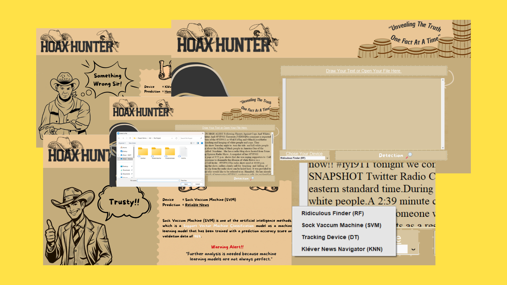

Berikut adalah repositori tugas akhir hasil kolaborasi antara mata kuliah Pemrosesan Teks dan Kecerdasan Buatan! 🎓🤖 
# Peningkatan Deteksi Berita Hoaks Menggunakan Seleksi Fitur Berbasis Algoritma Genetika dan Rekayasa Fitur Linguistik ! 🎉


[Atau anda bisa mengakses dataset tersebut di sini](https://www.kaggle.com/datasets/saurabhshahane/fake-news-classification)


## 📂 **Struktur Direktori**
```plaintext
├── notebooks/            # Jupyter Notebook untuk eksplorasi dan eksperimen
├── README.md             # Dokumentasi proyek
```

## 🎯 **Sehingga hasil yang diperoleh sebagai berikut**
.png)

## 🖥️ **Saya menyediakan interface sederhana untuk memudahkan pengguna dalam mengakses model.**


[Atau anda bisa pelajari lebih lanjut disini](https://www.canva.com/design/DAFxe8sUzhI/jIRJe5M9S1kbJdI2gVxpxw/editutm_content=DAFxe8sUzhI&utm_campaign=designshare&utm_medium=link2&utm_source=sharebutton)


